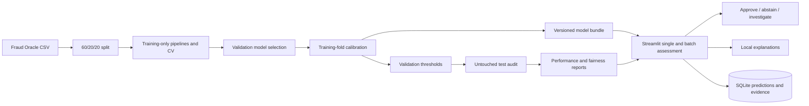

# Architecture

```mermaid
flowchart LR
    A[Fraud Oracle CSV] --> B[60/20/20 split]
    B --> C[Training-only pipelines and CV]
    C --> D[Validation model selection]
    D --> E[Training-fold calibration]
    E --> F[Validation thresholds]
    F --> G[Untouched test audit]
    E --> H[Versioned model bundle]
    H --> I[Streamlit single and batch assessment]
    I --> J[Approve / abstain / investigate]
    I --> K[Local explanations]
    I --> L[(SQLite predictions and evidence)]
    G --> M[Performance and fairness reports]
    M --> I
```

